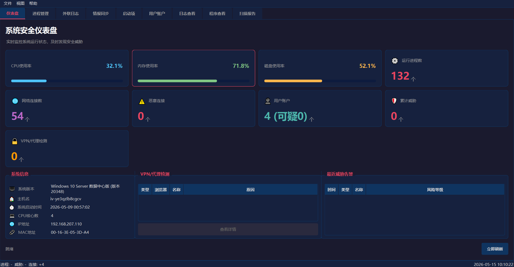
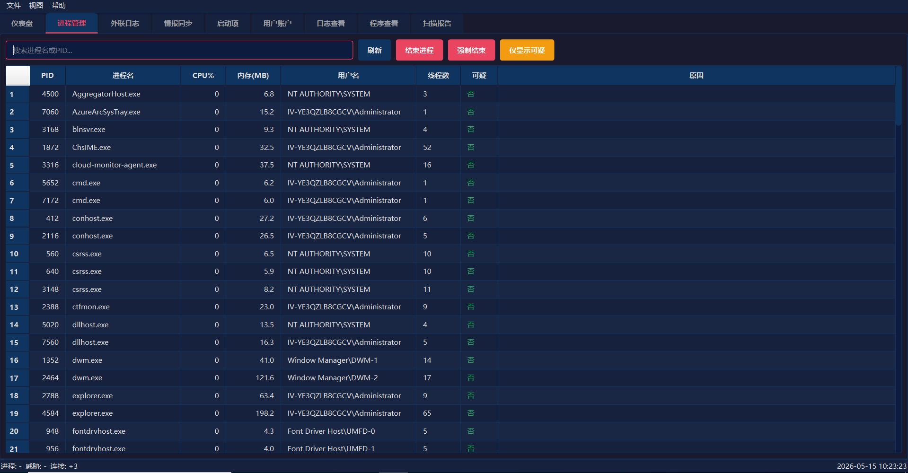
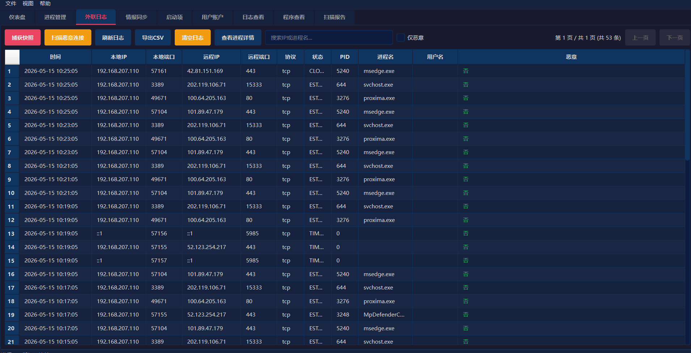
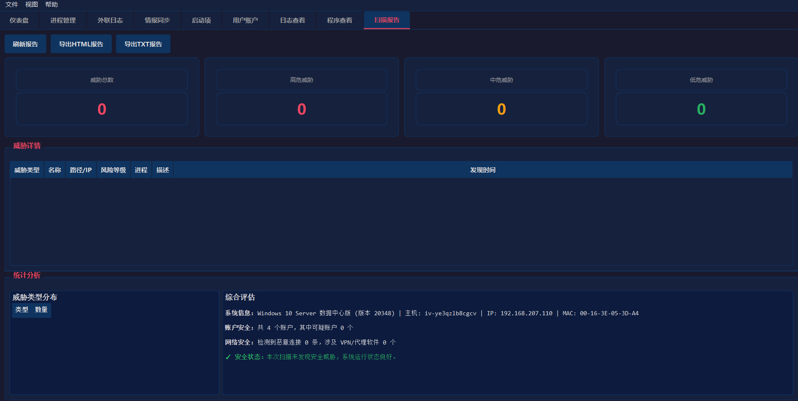

# 🔐 木马病毒排查工具

一款专用于木马病毒排查的网络安全分析工具，提供系统安全监控、威胁检测、信息收集、报告产出、协助分析能力。

---

## 📷 项目预览

<div align="center">
    
    
    
    
</div>

---

## ✨ 功能特性

### 🛡️ 核心安全功能

| 模块       | 功能描述                                |
| -------- | ----------------------------------- |
| **进程管理** | 实时监控系统进程，自动检测可疑进程、VPN/代理工具，支持进程结束操作 |
| **网络监控** | 捕获所有网络连接，记录外联日志，支持恶意IP检测和关键词搜索      |
| **软件扫描** | 扫描已安装软件，识别风险程序和VPN软件                |
| **威胁情报** | 内置恶意IP数据库，支持情报同步更新                  |
| **日志收集** | 系统日志收集与分析，追踪安全事件                    |

### 🔍 智能检测能力

- **VPN/代理检测**：自动识别 VPN 客户端程序
- **恶意IP拦截**：实时比对恶意IP数据库
- **可疑进程标记**：基于行为特征和关键词的智能检测
- **外联行为分析**：监控异常网络连接行为

### 📊 数据展示

- 直观的仪表盘展示系统安全状态（CPU/内存/磁盘使用率、进程数、连接数等）
- 实时统计卡片显示关键指标
- 威胁统计摘要分析
- 详细的扫描报告生成与导出

---

## 🛠️ 技术栈

- **桌面端**：Python 3.9+ + PyQt6 + psutil + SQLite3
- **服务端**：FastAPI + Uvicorn + SQLite3

---

## 📦 安装指南

### 独立运行模式

**桌面端打包后可以完全独立运行，无需依赖服务端！**

- 桌面端包含完整的恶意软件检测、进程管理、网络监控等核心功能
- 服务端仅用于集中管理多个客户端、同步威胁情报等功能
- 普通用户只需运行桌面端即可完成日常安全检测和处置

### 环境要求

- Python 3.9 或更高版本
- Windows
- pip 包管理器

### 步骤

1. **克隆项目**

```bash
git clone https://github.com/qiubo123/trojan-killer.git
cd trojan-killer
```

2. **安装依赖**

```bash
pip install -r requirements.txt
```

3. **启动桌面端**

```bash
python main.py
```

4. **启动服务端（可选）**

```bash
python server/run.py
```

---

## 🚀 使用说明

### 桌面端

启动后进入主界面，提供以下功能模块：

1. **仪表盘**：系统安全概览和状态监控
2. **进程管理**：查看和管理系统进程，识别可疑进程
3. **外联日志**：查看网络连接记录，搜索特定连接
4. **情报同步**：管理恶意IP列表，与服务端同步情报
5. **启动项**：查看和管理系统启动项
6. **用户账户**：查看系统用户信息
7. **日志查看**：系统日志和审计日志
8. **程序查看**：扫描已安装软件
9. **扫描报告**：生成并导出安全扫描报告

### 服务端

启动服务端后，通过浏览器访问管理后台：

- **地址**：http://127.0.0.1:18080/web/login.html
- **用户名**：admin
- **密码**：首次启动时控制台输出，首次启动按照输出要求填写即可
- **设置**：设置可访问网段范围要添加127.0.0.1，确保本地可访问管理，配置文件在database目录下,删除server_config.json后重新启动即可，数据库文件不要删除（重启后数据还在的）
- **客户端下载**：如果要实现客户端下载功能，可将生成的桌面端exe文件放到服务端download目录下，访问http://ip:18080/web/download.html 下载即可。

---

## 🔧 打包说明

### 打包成 EXE

```bash
# 安装打包工具
pip install pyinstaller

# 执行打包
pyinstaller build.spec
```

打包完成后，可执行文件位于 `dist/` 目录下。

### 自定义图标

将 `app.ico` 放在项目根目录，打包时会自动使用。

---

## 🔒 安全说明

1. **权限要求**：部分功能需要管理员权限
2. **数据隐私**：所有数据本地存储，不上传云端
3. **密钥管理**：API 密钥用于客户端与服务端认证，请妥善保管
4. **定期更新**：建议定期同步威胁情报

---

## 📄 许可证

MIT License

---

## 📞 联系方式

如有问题或建议，欢迎提交 Issue 或联系开发者。

---

## 💰 支持项目

创作不易，您的支持是我持续更新的动力！

| 微信支付 | 支付宝 |
|:---:|:---:|
|  |  |

<p align="center">你的支持是我持续更新的动力！❤️</p>